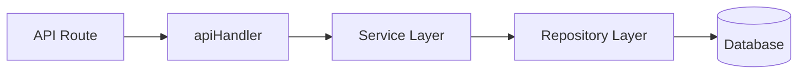

# SLTSERP Development Standards & Best Practices

Use this document as the "Gold Standard" when implementing new features or refactoring existing code.

## 1. Frontend Architecture & Performance

### A. The Antigravity Orchestrator Pattern
To maintain absolute clarity and performance, every new UI module MUST follow this hierarchy:
1.  **Orchestrator Page** (`page.tsx`): A stateless entry point that coordinates data fetching and component composition.
2.  **Functional Hook** (`hooks/use[Entity]Operations.ts`): Centralizes all business logic, mutations (via TanStack Query), and situational feedback (sonner).
3.  **High-Fidelity Components** (`components/*.tsx`): Modular parts like `[Entity]Table` and `[Entity]FormDialog` that focus purely on presentation and localized UX.

### B. Aesthetic Standard (High-Fidelity UI)
- **Glassmorphism**: Use `backdrop-blur-lg` and `bg-white/80` for elevated surfaces.
- **Micro-Animations**: Add `transition-all duration-300` and `hover:-translate-y-1` to interactive cards.
- **Deep Shadows**: Implement `shadow-2xl shadow-slate-200/50` for depth.
- **Status Badges**: Use curated HSL color palettes for distinct operational states.

### B. Dynamic Imports (Code Splitting)
- Use `next/dynamic` to load heavy components (especially Modals, Charts, and heavy Shadcn components) only when they are needed.
- This reduces the initial bundle size and improves First Contentful Paint (FCP).

```tsx
// Example
import dynamic from 'next/dynamic';
const MyHeavyModal = dynamic(() => import('@/components/modals/MyHeavyModal'), { ssr: false });
```

### C. State Management
- Keep state as local as possible.
- Use strict interfaces for all state variables and props.

### D. Navigation & Menu Management
- **Centralized Config**: ALWAYS use `src/config/sidebar-menu.ts` to manage sidebar items. NEVER hardcode links in the Sidebar component.
- **Role-Based Visibility**: Use the predefined `ROLE_GROUPS` in the config to control who sees what.

## 2. Forms & Data Validation (MANDATORY STANDARD)

### A. API Route Wrapper (apiHandler)
- **Standard**: EVERY API route MUST be wrapped with `apiHandler`. This centralizes:
    - **Validation**: Automatically validates the request body using Zod.
    - **RBAC**: Checks user roles before execution.
    - **Audit Logging**: Automatically logs mutations if configured.
    - **Error Handling**: Converts all errors to a standardized JSON response.

```typescript
// Example Implementation
export const POST = apiHandler(async (_req, _params, body) => {
    return await MyService.process(body);
}, { 
    schema: mySchema, 
    roles: ['ADMIN', 'SUPER_ADMIN'],
    audit: { action: 'CREATE', entity: 'MyEntity' }
});
```

### B. React Hook Form & Zod (Frontend)
- **Forms**: ALL forms MUST use **React Hook Form**.
- **Validation**: Use **Zod** schemas defined in `src/lib/validations/`.
- **UI Components**: Use Shadcn/UI Form components.

### C. Server-Side Pagination & Filtering (CRITICAL)
- **Standard**: For tables > 100 records, never fetch all data.
- **Implementation**: Handle pagination and filtering on the **Database level**.

## 3. Service-Repository Pattern (MANDATORY ARCHITECTURE)

### A. Repository Layer (Data Access)
- **Standard**: All direct database calls (Prisma) MUST reside in a Repository class.
- **Location**: `src/repositories/`
- **Rule**: Repositories should not contain business logic; they only handle CRUD and complex queries.

### B. Service Layer (Business Logic)
- **Standard**: Services coordinate between multiple Repositories and handle business rules.
- **Location**: `src/services/`
- **Rule**: Controllers (API Routes) should only call Services, never Repositories directly.



## 3. Security & Access Control (RBAC)

### A. API Route Protection
- **Role Validation**: Every write operation (POST, PUT, PATCH, DELETE) MUST verify the user's role using the `x-user-role` header (injected by middleware).
- **Identity Verification**: For strict actions (e.g., approvals), verify that the action performer matches the authenticated user (`x-user-id`).

```tsx
// Example RBAC Check
const role = request.headers.get('x-user-role');
if (role !== 'ADMIN' && role !== 'SUPER_ADMIN') {
    return NextResponse.json({ message: 'Forbidden' }, { status: 403 });
}
```

### B. Centralized Error Handling & Validation
- **Requirement**: Use `src/lib/api-utils.ts` for all API routes.
- **Handle Errors**: Use `handleApiError(error)` in catch blocks to ensure consistent error responses.
- **Validate Input**: Use `validateBody(request, schema)` to parse and validate JSON input at the entrance of the API.

### B. Middleware
- Ensure `src/middleware.ts` is up to date and correctly verifying JWT tokens for all `/api/` routes and protected pages.

## 4. UI/UX Design System

### A. Aesthetics (Glassmorphism & Modern UI)
- **Visuals**: Use "Premium" design tokens.
    - Backgrounds: Subtle application of `backdrop-blur`, semi-transparent whites (`bg-white/80`), and shadows (`shadow-xl`).
    - Animations: Add subtle transitions (`transition-all duration-200`) to interactive elements.
- **Responsiveness**: ALL pages must be fully responsive (Mobile -> Tablet -> Desktop). Use Tailwind's `md:`, `lg:` prefixes effectively.
- **Loading States**: Always show skeletons or loading spinners during data fetching.

### B. User Feedback
- Use clear success/error alerts (or toasts) for all user actions.
- Disable buttons and show loading indicators during async operations (`isSubmitting` state).

## 5. Coding Style

- **TypeScript**: No `any` types unless absolutely necessary. Define interfaces for Models, Props, and API Responses.
- **Clean Code**: Remove `console.log` in production code. Use descriptive variable names.

## 6. Advanced Data Fetching (Future Standard)

### A. React Query (TanStack Query)
- Transition from `useEffect` to **React Query** for server state management.
- **Benefits**: Automatic caching, background updates, and built-in loading/error states.
- This effectively prevents "layout shift" and makes the app feel instant to the user.

## 7. Reusable Logic (Custom Hooks)

### A. Logic Extraction
- Don't repeat `fetch` logic. Encapsulate common data fetching or logic into Custom Hooks.
- **Location**: `src/hooks/`
- **Example**: `useServiceOrders(opmcId)`, `useAuth()`.

## 8. API Security (Rate Limiting)

### A. Anti-Abuse Measures
- Implement Rate Limiting on public or sensitive API endpoints (like Login) to prevent brute-force attacks.
- Middleware should track request counts per IP address.

## 9. Database Performance & Optimization (STANDARD)

### A. Strategic Indexing (MUST)
- **Rule**: Every field used in a `where` clause, `orderBy`, or as a Foreign Key in a relation MUST have an index.
- **Implementation**: Add `@@index([fieldName])` to the model in `prisma/schema.prisma`.
- **Target**: IDs (Foreign Keys), Status fields, Dates, and common filter categories (e.g., `opmcId`, `contractorId`).

### B. Selective Querying
- **Rule**: Avoid fetching unneeded data. NEVER use a plain `findMany()` without filters or specific selects for large tables.
- **Implementation**: Use Prisma's `select` to pluck specific fields instead of fetching entire rows if only a few columns are needed for a list view.

### C. Connection Pooling
- **Standard**: Always use connection pooling in production (Prisma Accelerate / PgBouncer) to handle concurrent user spikes without exhausting database connections.

### D. Data Retention & Cleanup
- **Standard**: For high-volume transaction logs or notifications, implement a 30-day (or relevant) auto-cleanup policy using the `cleanup` methods provided in the service layer.

## 10. Real-time Communication (STANDARD)

### A. Server-Sent Events (SSE) Over Polling (MUST)
- **Standard**: Avoid traditional "Polling" (sending requests every few seconds) for live updates. This causes unnecessary network load.
- **Implementation**: ALWAYS use **Server-Sent Events (SSE)** for features requiring real-time reactivity (e.g., Notification Bell, Live Dashboard Stats, Active Stock Monitoring).
- **Pattern**:
    1.  Emit an event in the Service Layer when data changes (`lib/events.ts`).
    2.  Create a stream API route (`/api/.../stream`) to push updates.
    3.  Use `EventSource` in the React component to listen and update the individual Query Cache.

### B. Instant UI Updates
- **Standard**: When a real-time event is received, update the UI state (e.g., `queryClient.setQueryData`) immediately instead of waiting for a manual page refresh.

## 11. Audit Logging & State Traceability (NEW)

### A. Audit Mandate
- **Standard**: Every operation that **mutates** data (Create, Update, Delete, Status Change) MUST be logged using `AuditService.log`.
- **Content**: Log the `userId`, `action`, `entity`, `entityId`, and provide both `oldValue` and `newValue` (JSON format).
- **Goal**: Full history and accountability of "Who changed What and When".

### B. Selectivity for Performance
- **Standard**: NEVER fetch entire rows if only specific fields are needed.
- **Implementation**: Use Prisma's `select` to minimize the payload size sent over the network.
