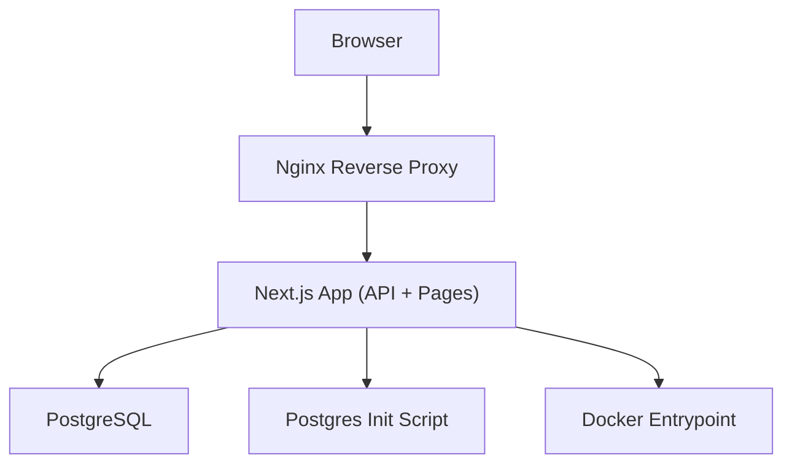
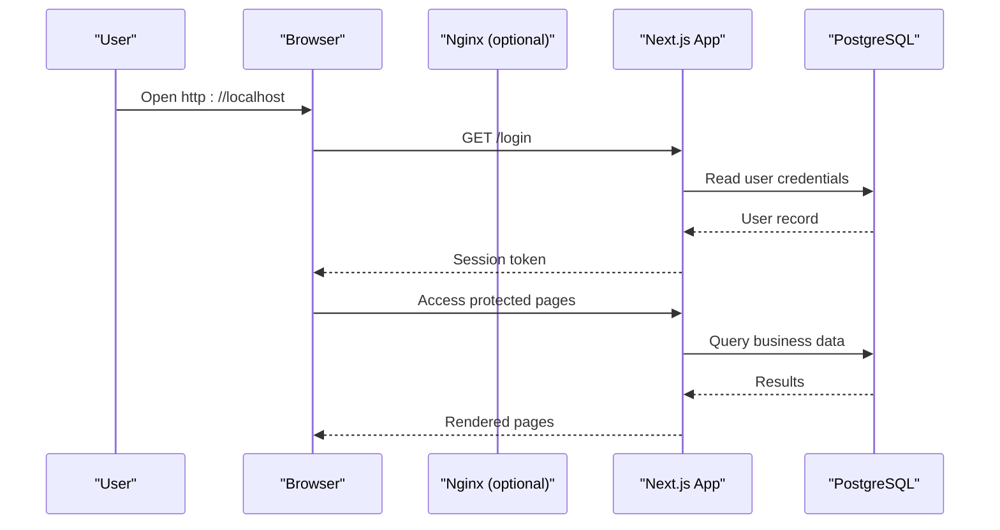

# Getting Started

<cite>
**Referenced Files in This Document**
- [README.md](file://README.md)
- [docker-compose.yml](file://docker-compose.yml)
- [Dockerfile](file://Dockerfile)
- [Dockerfile.prod](file://Dockerfile.prod)
- [docker-compose.prod.yml](file://docker-compose.prod.yml)
- [docker-entrypoint.sh](file://docker-entrypoint.sh)
- [next.config.ts](file://next.config.ts)
- [package.json](file://package.json)
- [prisma/schema.prisma](file://prisma/schema.prisma)
- [prisma/migrations/20251218143545_init/migration.sql](file://prisma/migrations/20251218143545_init/migration.sql)
- [postgres-init/01-init.sh](file://postgres-init/01-init.sh)
- [nginx/conf.d/default.conf](file://nginx/conf.d/default.conf)
- [src/app/api/login/route.ts](file://src/app/api/login/route.ts)
- [src/app/api/auth/forgot-password/reset/route.ts](file://src/app/api/auth/forgot-password/reset/route.ts)
- [src/lib/prisma.ts](file://src/lib/prisma.ts)
- [src/lib/auth.ts](file://src/lib/auth.ts)
- [src/middleware.ts](file://src/middleware.ts)
- [src/config/sidebar-menu.ts](file://src/config/sidebar-menu.ts)
</cite>

## Table of Contents
1. [Introduction](#introduction)
2. [System Requirements](#system-requirements)
3. [Project Structure](#project-structure)
4. [Core Components](#core-components)
5. [Architecture Overview](#architecture-overview)
6. [Installation and Setup](#installation-and-setup)
7. [Environment Configuration](#environment-configuration)
8. [Database Initialization](#database-initialization)
9. [First-Time Login](#first-time-login)
10. [Development Environment Setup](#development-environment-setup)
11. [Basic Navigation Overview](#basic-navigation-overview)
12. [Production Deployment](#production-deployment)
13. [Troubleshooting Guide](#troubleshooting-guide)
14. [Conclusion](#conclusion)

## Introduction
SLTSERP is an enterprise ERP solution designed for Sri Lanka Telecom to manage telecommunications infrastructure, projects, inventory, finance, GIS data, and operational workflows. It provides a unified platform for planning, execution, monitoring, and reporting across departments. The system is containerized for consistent deployment and includes Prisma-based database migrations, role-based access control, and a modern Next.js frontend.

This guide helps you install, configure, and run SLTSERP locally or in production, perform initial database setup, and complete your first login.

## System Requirements
- Docker and Docker Compose (latest stable versions)
- A machine with at least 4 GB RAM and 2 CPU cores recommended for local development
- Internet access for pulling base images and dependencies
- Optional: Git for cloning the repository

[No sources needed since this section provides general guidance]

## Project Structure
At a high level, SLTSERP consists of:
- Frontend and API routes built with Next.js
- Database schema and migrations managed by Prisma
- Container definitions for application, PostgreSQL, and optional services
- Nginx configuration for reverse proxy in production
- Scripts for initialization and entrypoint behavior

**Diagram sources**
- [docker-compose.yml](file://docker-compose.yml)
- [nginx/conf.d/default.conf](file://nginx/conf.d/default.conf)
- [Dockerfile](file://Dockerfile)
- [docker-entrypoint.sh](file://docker-entrypoint.sh)
- [postgres-init/01-init.sh](file://postgres-init/01-init.sh)

**Section sources**
- [docker-compose.yml](file://docker-compose.yml)
- [Dockerfile](file://Dockerfile)
- [Dockerfile.prod](file://Dockerfile.prod)
- [nginx/conf.d/default.conf](file://nginx/conf.d/default.conf)
- [postgres-init/01-init.sh](file://postgres-init/01-init.sh)

## Core Components
- Application runtime: Next.js app serving both UI and API routes
- Database: PostgreSQL with PostGIS extensions via Prisma
- Migrations: Prisma migration files under prisma/migrations
- Authentication: API endpoints for login and password reset
- Middleware: Request-level middleware for auth and routing
- Configuration: Next.js config and environment variables

Key implementation references:
- Prisma client initialization: [src/lib/prisma.ts](file://src/lib/prisma.ts)
- Auth utilities: [src/lib/auth.ts](file://src/lib/auth.ts)
- Login API route: [src/app/api/login/route.ts](file://src/app/api/login/route.ts)
- Password reset API route: [src/app/api/auth/forgot-password/reset/route.ts](file://src/app/api/auth/forgot-password/reset/route.ts)
- Middleware: [src/middleware.ts](file://src/middleware.ts)
- Sidebar menu structure: [src/config/sidebar-menu.ts](file://src/config/sidebar-menu.ts)

**Section sources**
- [src/lib/prisma.ts](file://src/lib/prisma.ts)
- [src/lib/auth.ts](file://src/lib/auth.ts)
- [src/app/api/login/route.ts](file://src/app/api/login/route.ts)
- [src/app/api/auth/forgot-password/reset/route.ts](file://src/app/api/auth/forgot-password/reset/route.ts)
- [src/middleware.ts](file://src/middleware.ts)
- [src/config/sidebar-menu.ts](file://src/config/sidebar-menu.ts)

## Architecture Overview
The system runs as containers orchestrated by Docker Compose. The Next.js app exposes API routes and serves the UI. PostgreSQL stores all relational data. An init script prepares the database on first run. In production, Nginx can be used as a reverse proxy.

**Diagram sources**
- [docker-compose.yml](file://docker-compose.yml)
- [nginx/conf.d/default.conf](file://nginx/conf.d/default.conf)
- [src/app/api/login/route.ts](file://src/app/api/login/route.ts)
- [src/lib/prisma.ts](file://src/lib/prisma.ts)

## Installation and Setup
Follow these steps to get SLTSERP running using Docker Compose.

1. Clone the repository and navigate to the project root.
2. Ensure Docker and Docker Compose are installed and running.
3. Start the stack:
   - Development: `docker compose up`
   - Production: `docker compose -f docker-compose.prod.yml up -d`
4. Wait for services to initialize. The app will be available at http://localhost unless overridden by configuration.

Notes:
- The default compose file defines the app, database, and any auxiliary services required for local development.
- The production compose file may include additional configurations such as persistent volumes and reverse proxy settings.

**Section sources**
- [docker-compose.yml](file://docker-compose.yml)
- [docker-compose.prod.yml](file://docker-compose.prod.yml)
- [Dockerfile](file://Dockerfile)
- [Dockerfile.prod](file://Dockerfile.prod)

## Environment Configuration
Configure the application via environment variables. Create a .env file in the project root if not present, and set values appropriate for your environment.

Common categories of variables:
- Database connection details (host, port, user, password, database name)
- Application URL and CORS settings
- Authentication secrets and session configuration
- Feature flags and logging levels

Where to look:
- Next.js configuration: [next.config.ts](file://next.config.ts)
- Package scripts and dependencies: [package.json](file://package.json)
- Docker entrypoint behavior: [docker-entrypoint.sh](file://docker-entrypoint.sh)

Best practices:
- Keep secrets out of version control; use Docker secrets or secure secret managers in production.
- Validate that the database host and credentials match the service names defined in docker-compose.yml.

**Section sources**
- [next.config.ts](file://next.config.ts)
- [package.json](file://package.json)
- [docker-entrypoint.sh](file://docker-entrypoint.sh)

## Database Initialization
SLTSERP uses Prisma for schema management and migrations.

Steps:
1. Ensure the PostgreSQL service is running and reachable from the app container.
2. Apply migrations:
   - Development: Run the Prisma migration command within the app container or via the provided scripts.
   - Production: Apply migrations during deployment before starting the app.
3. Seed data (if available): Use seed scripts included in the repository to populate initial reference data.

Relevant files:
- Schema definition: [prisma/schema.prisma](file://prisma/schema.prisma)
- Initial migration: [prisma/migrations/20251218143545_init/migration.sql](file://prisma/migrations/20251218143545_init/migration.sql)
- Database init script: [postgres-init/01-init.sh](file://postgres-init/01-init.sh)

Tips:
- If you rebuild the database frequently during development, consider resetting migrations carefully and re-applying them.
- Verify PostGIS extensions are enabled if spatial features are required.

**Section sources**
- [prisma/schema.prisma](file://prisma/schema.prisma)
- [prisma/migrations/20251218143545_init/migration.sql](file://prisma/migrations/20251218143545_init/migration.sql)
- [postgres-init/01-init.sh](file://postgres-init/01-init.sh)

## First-Time Login
After successful setup and migrations:
1. Open the application in your browser.
2. Navigate to the login page.
3. Enter the default administrator credentials provided by your installation process.
4. Upon successful authentication, you will be redirected to the dashboard.

If you forget your password:
- Use the forgot-password flow to request a reset link.
- Follow the instructions in the email to set a new password.

References:
- Login API route: [src/app/api/login/route.ts](file://src/app/api/login/route.ts)
- Password reset API route: [src/app/api/auth/forgot-password/reset/route.ts](file://src/app/api/auth/forgot-password/reset/route.ts)

**Section sources**
- [src/app/api/login/route.ts](file://src/app/api/login/route.ts)
- [src/app/api/auth/forgot-password/reset/route.ts](file://src/app/api/auth/forgot-password/reset/route.ts)

## Development Environment Setup
For local development without Docker:
1. Install Node.js and npm/yarn as specified in package.json.
2. Install dependencies: `npm install`
3. Configure environment variables in .env.
4. Set up the database locally (PostgreSQL with PostGIS).
5. Run Prisma migrations and seed data.
6. Start the development server: `npm run dev`

Containerized development:
- Use docker compose to start all services together.
- Mount source code for hot reloading if configured.
- Use the provided scripts for common tasks like checking logs and restarting services.

References:
- Dependencies and scripts: [package.json](file://package.json)
- Next.js configuration: [next.config.ts](file://next.config.ts)
- Docker entrypoint: [docker-entrypoint.sh](file://docker-entrypoint.sh)

**Section sources**
- [package.json](file://package.json)
- [next.config.ts](file://next.config.ts)
- [docker-entrypoint.sh](file://docker-entrypoint.sh)

## Basic Navigation Overview
After logging in, you can navigate through the main sections using the sidebar menu. Key areas typically include:
- Dashboard: Overview of metrics and quick actions
- Projects: Project lifecycle and tracking
- Inventory: Stock management, requests, issues, and reports
- Finance: Payments, vendors, cost allocation, and retention
- Helpdesk: Tickets and knowledge base
- Admin: Users, roles, permissions, and system settings

Menu structure reference:
- Sidebar configuration: [src/config/sidebar-menu.ts](file://src/config/sidebar-menu.ts)

**Section sources**
- [src/config/sidebar-menu.ts](file://src/config/sidebar-menu.ts)

## Production Deployment
To deploy SLTSERP in production:
1. Prepare environment variables for production (database, URLs, secrets).
2. Build the application image using the production Dockerfile.
3. Run the production compose stack:
   - `docker compose -f docker-compose.prod.yml up -d`
4. Configure Nginx as a reverse proxy if needed.
5. Apply Prisma migrations before starting the app.
6. Monitor logs and health endpoints.

References:
- Production compose file: [docker-compose.prod.yml](file://docker-compose.prod.yml)
- Production Dockerfile: [Dockerfile.prod](file://Dockerfile.prod)
- Nginx configuration: [nginx/conf.d/default.conf](file://nginx/conf.d/default.conf)

**Section sources**
- [docker-compose.prod.yml](file://docker-compose.prod.yml)
- [Dockerfile.prod](file://Dockerfile.prod)
- [nginx/conf.d/default.conf](file://nginx/conf.d/default.conf)

## Troubleshooting Guide
Common issues and resolutions:
- Cannot connect to database:
  - Verify DATABASE_URL and service names in docker-compose.yml.
  - Ensure the database container is healthy and ports are exposed correctly.
- Migration failures:
  - Check Prisma schema and migration files for errors.
  - Re-run migrations after fixing schema changes.
- Login fails:
  - Confirm admin user exists and credentials are correct.
  - Review auth middleware and session configuration.
- CORS or URL mismatches:
  - Update NEXT_PUBLIC_APP_URL and related settings in .env.
- Nginx 502 errors:
  - Verify upstream service is running and listening on the expected port.

Useful references:
- Prisma client: [src/lib/prisma.ts](file://src/lib/prisma.ts)
- Auth utilities: [src/lib/auth.ts](file://src/lib/auth.ts)
- Middleware: [src/middleware.ts](file://src/middleware.ts)
- Docker entrypoint: [docker-entrypoint.sh](file://docker-entrypoint.sh)

**Section sources**
- [src/lib/prisma.ts](file://src/lib/prisma.ts)
- [src/lib/auth.ts](file://src/lib/auth.ts)
- [src/middleware.ts](file://src/middleware.ts)
- [docker-entrypoint.sh](file://docker-entrypoint.sh)

## Conclusion
You now have the essentials to install, configure, and run SLTSERP locally or in production. Use the troubleshooting guide to resolve common setup issues, and refer to the navigation overview to explore core modules. For advanced customization, consult the configuration files and Prisma schema to tailor the system to your organization’s needs.

[No sources needed since this section summarizes without analyzing specific files]