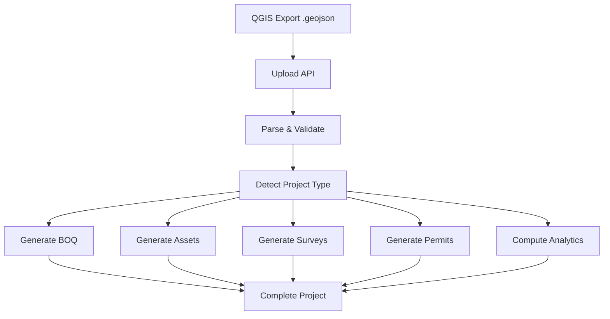

# 🏗️ SLTS ERP - GIS to Project Management Pipeline
## සම්පූර්ණ මාර්ගෝපදේශය | Complete Step-by-Step Guide

---

**📌 අලුතෙන් එන කෙනෙකුට පවා පහසුවෙන් තේරෙන විදියට මෙම Guide එක ලියා ඇත.**
*(Written so that even a newcomer can easily understand and follow.)*

---

## 📑 පටුන | Table of Contents

1. [Introduction - මේක මොකක්ද?](#1-introduction)
2. [System Requirements - අවශ්‍ය මොනවාද?](#2-system-requirements)
3. [Quick Start - ඉක්මන් ආරම්භය](#3-quick-start)
4. [Step 1: GIS Files Prepare කරන්න](#4-step-1-gis-files-prepare-කරන්න)
5. [Step 2: Files Upload කරන්න](#5-step-2-files-upload-කරන්න)
6. [Step 3: Data Process කරන්න](#6-step-3-data-process-කරන්න)
7. [Step 4: Results බලන්න](#7-step-4-results-බලන්න)
8. [Project Module Features - මොනවා කරන්න පුළුවන්ද?](#8-project-module-features)
9. [API Endpoints - Backend Services](#9-api-endpoints)
10. [Running Tests - Test කරන හැටි](#10-running-tests)
11. [Troubleshooting - ප්‍රශ්න ඇතිවුනොත්](#11-troubleshooting)

---

## 1. Introduction - මේක මොකක්ද?

**SLTS ERP GIS Pipeline** එක කරන්නේ **QGIS** (Quantum GIS) software එකෙන් export කරපු **GeoJSON files** auto-process කරලා **Project Management system** එකට දාන එක.

### 🔄 Flow එක මෙහෙමයි:

```
QGIS (.geojson) → Upload → Parse → Validate → Detect → BOQ → Assets → Survey → Permits → Project!
```

**Input:** QGIS එකෙන් export කරපු GeoJSON files 5ක්
**Output:** Complete project එකක් (BOQ, Assets, Survey Tasks, Permits ඔක්කමත් එක්ක)

### 📂 GIS Files 5 මොනවාද?

| File Name | Content | Layer Type |
|-----------|---------|------------|
| `ProjectName_Cables.geojson` | Fiber optic cables (lines) | `CABLE` |
| `ProjectName_Poles.geojson` | Telecom poles (points) | `POLE` |
| `ProjectName_FDP.geojson` | Fiber Distribution Points | `FDP` |
| `ProjectName_FJ.geojson` | Fiber Joint closures | `FIBER_JOINT` |
| `ProjectName_Road_EOPs.geojson` | Roads/EOPs (lines) | `ROAD_EOP` |

> 💡 **File Naming Rule:** File එකේ නමේ `_Cables`, `_Poles`, `_FDP`, `_FJ`, `_Road_EOPs` කියන keywords තියෙන්න ඕන. එතකොට system එක auto-detect කරනවා.

---

## 2. System Requirements - අවශ්‍ය මොනවාද?

### ✅ Required Software

| Software | Version | Purpose |
|----------|---------|---------|
| **Node.js** | v18+ | Runtime environment |
| **npm** | v9+ | Package manager |
| **PostgreSQL** | v14+ | Database |
| **QGIS** | v3.x (optional) | GIS data export කරන්න |

### ✅ ඔයාට මේ files තියෙනවාද? Check කරන්න:

```
d:\MyProject\SLTSERP\
  ├── src/
  │   ├── types/gis.ts           ✅ GIS type definitions
  │   ├── lib/gis/
  │   │   ├── gis-parser.ts      ✅ GeoJSON parser
  │   │   ├── gis-validator.ts   ✅ Data validator
  │   │   ├── project-type-detector.ts  ✅ Project type detect
  │   │   ├── boq-engine.ts      ✅ BOQ generator
  │   │   ├── asset-engine.ts    ✅ Asset register generator
  │   │   ├── survey-generator.ts  ✅ Survey task generator
  │   │   ├── permit-generator.ts  ✅ Permit generator
  │   │   └── gis-analytics-engine.ts ✅ Analytics engine
  │   ├── services/GISImportService.ts  ✅ Main service
  │   ├── app/api/gis/           ✅ REST APIs
  │   └── components/gis/        ✅ UI components
  ├── test-gis-e2e.ts             ✅ Test file
  └── KL-SVK-0567/GeoJSON/       ✅ Sample GIS data
```

---

## 3. Quick Start - ඉක්මන් ආරම්භය

### 🚀 විනාඩි 5න් Start කරන්න

#### Step 1: Dependencies install කරන්න
```bash
cd d:\MyProject\SLTSERP
npm install
```

#### Step 2: Test එක run කරලා බලන්න හැම දෙයක්ම වැඩ කරනවද කියලා
```bash
npx tsx test-gis-e2e.ts
```
**Result:** `✅ 72/72 tests passed!` කියලා පෙන්නන්න ඕන.

#### Step 3: Dev server එක start කරන්න
```bash
npx next dev
```
**Open:** `http://localhost:3000/gis/upload`

---

## 4. Step 1: GIS Files Prepare කරන්න

### QGIS වලින් Export කරන හැටි (QGIS 3.x)

#### 🎯 Cables Layer Export
1. QGIS එකේදී ඔයාගේ cable layer එක right-click කරන්න
2. **Export → Save Features As...** තෝරන්න
3. **Format:** `GeoJSON`
4. **File name:** `KL-SVK-0567_Cables.geojson` (ව්‍යාපෘතියේ නම `_Cables` කියලා)
5. **CRS:** `WGS 84 (EPSG:4326)` - මේක තෝරන්නම ඕන!
6. **OK** click කරන්න

#### 🎯 Poles Layer Export
- එකම විදියටම, file name එක `_Poles.geojson` කියලා දෙන්න

#### 🎯 FDP Layer Export
- File name: `_FDP.geojson`
- Properties වල `FDP NAME` column එක තියෙන්න ඕන (FDP එකේ code එක)

#### 🎯 Fiber Joint Export
- File name: `_FJ.geojson`

#### 🎯 Road/EOP Export
- File name: `_Road_EOPs.geojson`
- Properties වල `Road_Name` column එක තියෙන්න ඕන

### 📁 Folder Structure එක මෙහෙම වෙන්න ඕන:
```
KL-SVK-0567/
  └── GeoJSON/
      ├── KL-SVK-0567_Cables.geojson
      ├── KL-SVK-0567_Poles.geojson
      ├── KL-SVK-0567_FDP.geojson
      ├── KL-SVK-0567_FJ.geojson
      └── KL-SVK-0567_Road_EOPs.geojson
```

---

## 5. Step 2: Files Upload කරන්න

### 🌐 Web UI එකෙන් Upload කරන හැටි

1. **Browser එකෙන් මේ link එක open කරන්න:**
   ```
   http://localhost:3000/gis/upload
   ```

2. **GIS Upload page එක open වෙයි** - Drag & Drop box එකක් පෙනෙයි

3. **Upload කරන්න:** ඔයාගේ 5 GeoJSON files select කරලා drop කරන්න
   - එක වාරේම files 5ම upload කරන්න පුළුවන්
   - File names auto-detect වෙයි

4. **Upload button එක click කරන්න**

### 🔌 API එකෙන් Upload කරන හැටි (Code වලින්)

```bash
# කැමති වාගේ API client එකකින් (Postman, curl)
curl -X POST http://localhost:3000/api/gis/upload \
  -F "files=@KL-SVK-0567_Cables.geojson" \
  -F "files=@KL-SVK-0567_Poles.geojson" \
  -F "files=@KL-SVK-0567_FDP.geojson" \
  -F "files=@KL-SVK-0567_FJ.geojson" \
  -F "files=@KL-SVK-0567_Road_EOPs.geojson"
```

**Response:**
```json
{
  "sessionId": "abc123-...",
  "files": 5,
  "detectedLayers": ["CABLE", "POLE", "FDP", "FIBER_JOINT", "ROAD_EOP"],
  "status": "UPLOADED"
}
```

> ⚠️ Upload කරාට පස්සේ **sessionId** එක save කරගන්න! Process කරන්න ඒක ඕන වෙයි.

---

## 6. Step 3: Data Process කරන්න

Upload කරපු GIS data process කරන්න:

### 🔌 API එකෙන් Process කරන හැටි

```bash
curl -X POST http://localhost:3000/api/gis/process \
  -H "Content-Type: application/json" \
  -d '{
    "sessionId": "abc123-...",
    "projectName": "KL-SVK-0567 Fiber Project",
    "region": "Eastern",
    "district": "Kalmunai"
  }'
```

**Process එක ඇතුලේ Auto වෙන දේවල්:**

| Phase | What Happens | Output |
|-------|-------------|--------|
| 1️⃣ Parse | GeoJSON parse කරලා structured data වලට හරවනවා | Cables, Poles, FDPs, Joints, Roads |
| 2️⃣ Validate | Data එක check කරනවා (required fields, types) | Validation report |
| 3️⃣ Detect | Project type එක detect කරනවා | SSD / Cluster / Building Fiber |
| 4️⃣ BOQ | Bill of Quantities generate කරනවා | 7 BOQ items, Total cost |
| 5️⃣ Assets | Asset register generate කරනවා | 48 assets with codes |
| 6️⃣ Survey | Survey tasks create කරනවා | 153 tasks |
| 7️⃣ Permits | Permits generate කරනවා | 29 permits |
| 8️⃣ Analytics | Route length, coverage calculate කරනවා | Analytics report |

### 🖥️ Response එක (Process Result)

```json
{
  "success": true,
  "project": {
    "code": "FSSD_SLTS_2026_001",
    "type": "SSD",
    "confidence": 95
  },
  "boq": {
    "totalCost": 6023674.21,
    "items": 7
  },
  "assets": { "count": 48, "categories": { "POLE": 36, "FDP": 6, ... } },
  "surveyTasks": { "count": 153, "types": { "POLE_VERIFICATION": 43, ... } },
  "permits": { "count": 29, "roadCutting": 28, "wayleave": 1 },
  "analytics": {
    "routeLength": 1406.38,
    "poleCount": 36,
    "fdpCount": 6,
    "areaCovered": 2852925.61
  }
}
```

---

## 7. Step 4: Results බලන්න

### 📊 GIS Map View එක

```
http://localhost:3000/projects/[projectId]/gis
```

මෙතනදී:
- 🗺️ Leaflet map එකේ **GIS layers visualize** වෙනවා
- ✅ **Layer toggle buttons** - Cables, Poles, FDPs, Joints, Roads
- 👆 **Click features** - ඕන feature එකක් click කළාම details show වෙනවා
- 🔍 **Zoom & Pan** - Map එක navigate කරන්න

### 📋 Project Status Check කරන්න

```bash
# Session status එක බලන්න
curl http://localhost:3000/api/gis?sessionId=abc123-...

# All sessions list එක
curl http://localhost:3000/api/gis
```

---

## 8. Project Module Features

### 🎯 1. Project Type Detection (auto)

System එක auto detect කරනවා මේ project types:

| Type | කොහමද detect කරන්නේ? | Example |
|------|----------------------|---------|
| **SSD** | FDPs + Cables + Poles + Joints | KL-SVK-0567 (95% confidence) |
| **Cluster** | Route > 5km, Poles > 50 | Large housing projects |
| **Building Fiber** | High density FDPs, short cables | Apartment buildings |

### 📋 2. BOQ Items (auto generate)

| Item | Unit Rate (LKR) | Source |
|------|----------------|--------|
| Fiber Optic Cable | 850/meter | Cable length |
| Telecom Pole | 45,000/each | Pole count |
| FDP | 35,000/each | FDP count |
| Fiber Joint | 25,000/each | Joint count |
| Warning Tape | 150/meter | Cable length * 1.1 |
| Road Crossing | 85,000/each | Road count |
| Accessories | 8% of material | Auto calculated |

### 🏷️ 3. Asset Codes Format

```
{PROJECT_TYPE}_SLTS_{YEAR}_{SEQUENCE}-{ASSET_TYPE}-{NUMBER}

Example: FSSD_SLTS_2026_001-POL-0001
         ↑                     ↑      ↑
    Project Code           Type   Number
```

**Asset Types:** `CBL` (Cable), `POL` (Pole), `FDP` (FDP), `FJ` (Fiber Joint), `FR` (Fiber Route)

### ✅ 4. Survey Task Types

| Task Type | Purpose | Generated For |
|-----------|---------|--------------|
| POLE_VERIFICATION | Pole details check | Each pole + FDP + joint |
| GPS_CAPTURE | GPS coordinates capture | Each pole + FDP |
| PHOTO_COLLECTION | Site photos | Each pole |
| ROUTE_VERIFICATION | Route survey | Road segments |

### 📜 5. Permit Types

| Permit | Authority | Generated From |
|--------|-----------|---------------|
| Road Cutting | Municipal Council | Road segments |
| Wayleave | Survey Department | Pole locations |

---

## 9. API Endpoints

### 📡 REST API Summary

| Method | Endpoint | Purpose |
|--------|----------|---------|
| **POST** | `/api/gis/upload` | GIS files upload කරන්න |
| **POST** | `/api/gis/process` | Upload කරපු data process කරන්න |
| **GET** | `/api/gis` | Session status / all sessions බලන්න |

### Full API Request/Response Examples

#### POST /api/gis/upload
**Request:** `multipart/form-data` (files)
**Response:**
```json
{
  "sessionId": "uuid-string",
  "files": [
    { "fileName": "Cables.geojson", "layerType": "CABLE", "features": 4 },
    { "fileName": "Poles.geojson", "layerType": "POLE", "features": 36 },
    { "fileName": "FDP.geojson", "layerType": "FDP", "features": 6 },
    { "fileName": "FJ.geojson", "layerType": "FIBER_JOINT", "features": 1 },
    { "fileName": "Road_EOPs.geojson", "layerType": "ROAD_EOP", "features": 28 }
  ],
  "status": "UPLOADED"
}
```

#### POST /api/gis/process
**Request:**
```json
{
  "sessionId": "uuid-string",
  "projectName": "KL-SVK-0567",
  "region": "Eastern",
  "district": "Kalmunai"
}
```
**Response:** (See Step 3 above)

#### GET /api/gis
**Response:**
```json
{
  "sessions": ["uuid-1", "uuid-2"],
  "activeSessions": 2
}
```

---

## 10. Running Tests

### 🧪 End-to-End Test

Test එක run කරන්න:
```bash
npx tsx test-gis-e2e.ts
```

**Test එක කරන්නේ මොනවාද?**
- **Phase 1:** GeoJSON files 5ම load කරනවා
- **Phase 2:** Layer types detect කරනවා
- **Phase 3:** Data parse කරනවා (cables, poles, fdps, joints, roads)
- **Phase 4:** Data validate කරනවා
- **Phase 5:** Project type detect කරනවා (SSD)
- **Phase 6:** BOQ generate කරනවා
- **Phase 7:** Asset register generate කරනවා
- **Phase 8:** Analytics compute කරනවා
- **Phase 9:** Survey tasks generate කරනවා
- **Phase 10:** Permits generate කරනවා

**Expected Result:**
```
Total Assertions: 72
✅ Passed: 72
❌ Failed: 0
🎉 ALL TESTS PASSED!
```

---

## 11. Troubleshooting

### ❌ Common Problems & Solutions

#### Problem 1: "File not detected as correct layer type"
**Cause:** File name එකේ correct keyword එක නැති වීම
**Fix:** File name එක මෙහෙම වෙනස් කරන්න:
- `_Cables.geojson` (CABLE layer)
- `_Poles.geojson` (POLE layer)
- `_FDP.geojson` (FDP layer)
- `_FJ.geojson` (FIBER_JOINT layer)
- `_Road_EOPs.geojson` (ROAD_EOP layer)

#### Problem 2: "Parse error: Invalid GeoJSON"
**Cause:** File එක හරි GeoJSON format එකේ නැති වීම
**Fix:** 
1. QGIS එකෙන් "Save Features As..." කරනකොට **GeoJSON** format එක තෝරන්න
2. **CRS:** WGS 84 (EPSG:4326) තෝරන්න

#### Problem 3: "Module not found: @/types/gis"
**Cause:** tsconfig paths configuration නැති වීම
**Fix:** `tsconfig.json` එකේ මේක තියෙනවාද check කරන්න:
```json
{
  "compilerOptions": {
    "paths": {
      "@/*": ["./src/*"]
    }
  }
}
```

#### Problem 4: "npx tsx test-gis-e2e.ts working නැත්නම්"
**Cause 1:** PowerShell එකේ `&&` වැඩ කරන්නේ නැති වීම
**Fix 1:** මෙහෙම දාන්න:
```bash
cmd /c "cd d:\MyProject\SLTSERP && npx tsx test-gis-e2e.ts"
```

**Cause 2:** `tsx` installed නැති වීම
**Fix 2:**
```bash
npx tsx --version
# If not found:
npm install -g tsx
```

#### Problem 5: "Pole count වැරදියි"
**Cause:** Test එකේ expected value එක real data එකට වඩා වෙනස් වීම
**Fix:** `test-gis-e2e.ts` file එකේ මේ values update කරන්න:
- `EXPECTED.poles.featureCount` = ඔයාගේ real pole count එක
- `assert(poleData.featureCount === X` (X වෙනුවට real count එක)

#### Problem 6: "FDP names blank / null"
**Cause:** QGIS properties වල `"FDP NAME"` key එක නැති වීම
**Fix:** FDP GeoJSON file එකේ properties check කරන්න. Properties object එකේ මේ keys වලින් එකක් තියෙන්න ඕන:
- `"FDP NAME"` (UPPERCASE with space)
- `"fdp_code"`
- `"fdpCode"`

#### Problem 7: "Road names show as 'Road 1', 'Road 2'..."
**Cause:** Properties වල `"Road_Name"` key එක නැති වීම
**Fix:** Road GeoJSON file එකේ properties check කරන්න. මේ keys වලින් එකක් තියෙන්න ඕන:
- `"Road_Name"`
- `"road_name"`
- `"ROAD NAME"`

### 💡 Tips

1. **Upload කරන්න කලින්** files 5ම තියෙනවාද කියලා check කරන්න
2. **Project name** එකට `KL-SVK-0567` වගේ meaningful name එකක් දෙන්න
3. **Process result** එකේ `sessionId` එක save කරගන්න
4. **Test එක run කරන්න** හැම change එකකටම පස්සේ
5. **QGIS export** කරනකොට **WGS 84 (EPSG:4326)** CRS එක තෝරන්නම ඕන

---

## 📞 Support

**Technical Contact:** System Administrator
**Project Repository:** https://github.com/madu025/SLTSERP

---

## 🎯 Summary - ඉක්මන් Reference එක



**Commands Summary:**
```bash
# 1. Test run කරන්න
npx tsx test-gis-e2e.ts

# 2. Dev server start කරන්න
npx next dev

# 3. Upload GIS files
curl -X POST http://localhost:3000/api/gis/upload -F "files=@..."

# 4. Process data
curl -X POST http://localhost:3000/api/gis/process ...
```

---

> **🎉 සුභ පැතුම්!** දැන් ඔයාට SLTS ERP GIS Pipeline එක A to Z use කරන්න පුළුවන්!
> *(Congratulations! Now you can use the SLTS ERP GIS Pipeline from A to Z!)*
