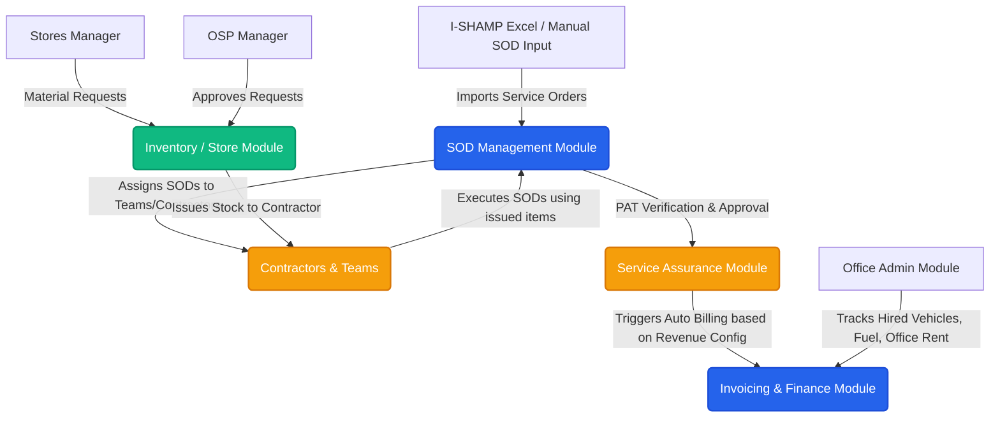

# SLTS OSP Nexus - Project Walkthrough & Architecture Overview

මෙම ලියකියවිල්ල මඟින් **SLTS OSP Nexus (SLTSERP)** පද්ධතියේ සම්පූර්ණ කාර්යභාරය (Core Purpose), පද්ධති මොඩියුල (System Modules), දත්ත සමුදාය ව්‍යුහය (Database Structure) සහ ක්‍රියාවලි (Workflows) පිළිබඳ සවිස්තරාත්මක විග්‍රහයක් ලබාදේ.

---

## 1. Project Overview (පද්ධති හැඳින්වීම)

**SLTS OSP Nexus** යනු **Sri Lanka Telecom (Services) Ltd. (SLTS)** ආයතනයේ **Outside Plant (OSP)** සේවා ඇණවුම් (Service Orders), තොග කළමනාකරණය (Inventory Management), අනුබද්ධ කොන්ත්‍රාත්කරුවන් කළමනාකරණය (Contractor Management) සහ බිල්පත්කරණය (Invoicing) විධිමත් කිරීම සඳහා නිර්මාණය කර ඇති වෙබ් පාදක ERP (Enterprise Resource Planning) පද්ධතියකි.

### ප්‍රධාන අරමුණ (Core Goal)
* සේවා සපයන්නන් සහ කොන්ත්‍රාත්කරුවන් අතර සම්බන්ධතාවය විනිවිදභාවයකින් යුතුව පවත්වා ගැනීම.
* ද්‍රව්‍ය නිකුත් කිරීමේ සිට (Material Issue) ඒවා භාවිතය (Material Usage) සහ ඉතිරි ද්‍රව්‍ය නැවත භාරදීම (Material Return/Reconciliation) දක්වා වූ ක්‍රියාවලිය ස්වයංක්‍රීය කිරීම.
* Excel මඟින් සිදු කරන අතින් ලියන ලද කාර්යයන් සහ දත්ත විසිරීම් අවම කර තත්‍ය කාලීන (Real-time) දත්ත නිරීක්ෂණය (Dashboard Monitoring) ලබා දීම.

---

## 2. High-Level Architecture (පද්ධති ගෘහ නිර්මාණ ශිල්පය)

පද්ධතියේ ප්‍රධාන සංරචක සහ ඒවා එකිනෙක සම්බන්ධ වන ආකාරය පහත දැක්වේ:



---

## 3. Core System Modules (ප්‍රධාන මොඩියුලයන්)

### 3.1. Inventory & Store Management (තොග ගබඩා කළමනාකරණය)
ප්‍රධාන සහ ශාඛා ගබඩා (Main & Sub Stores) අතර ද්‍රව්‍ය හුවමාරුව සහ නිකුත් කිරීම් පාලනය කරයි.
* **Goods Received Note (GRN):** ලැබෙන අමුද්‍රව්‍ය පද්ධතියට ඇතුළත් කිරීම (External SLT මිලදී ගැනීම් හෝ දේශීය මිලදී ගැනීම් සඳහා).
* **Material Request & Approval:** Stores Manager විසින් කරනු ලබන ඉල්ලීම් OSP Manager විසින් අනුමත කිරීමේ ක්‍රියාවලිය.
* **Material Return Note (MRN):** භාවිත නොකළ හෝ දෝෂ සහිත (Defective/Unused) ද්‍රව්‍ය නැවත ගබඩාව වෙත භාර දීමේ ක්‍රියාවලිය.
* **Store-wise Material Swap:** ගබඩාවන් අතර තොග හුවමාරුව.

### 3.2. SOD (Service Order Details) Management
පාරිභෝගික සේවා ස්ථාපනයන් (FTTH Installation, Copper, etc.) හා සම්බන්ධ සේවා ඇණවුම් නිරීක්ෂණය කරයි.
* **Excel Import:** SLT I-SHAMP පද්ධතියෙන් ලබාගන්නා Excel ලිපිගොනු ඍජුවම පද්ධතියට ඇතුළත් කිරීම.
* **Contractor Assignment:** අදාළ කොන්ත්‍රාත්කරුවන් සහ සේවා කණ්ඩායම් (Teams) වෙත සේවා ඇණවුම් පවරනු ලැබීම.
* **Material Usage Tracking:** එක් එක් සේවා ඇණවුම සඳහා කොන්ත්‍රාත්කරුවන් විසින් භාවිතා කළ ද්‍රව්‍ය ප්‍රමාණ වාර්තා කිරීම.
* **SOD Revenue Configuration:** RTOM (Regional Telecom Office) සහ චක්‍රලේඛ (Circulars) අනුව එක් සේවා ඇණවුමකට ලැබෙන ආදායම (Revenue Per SOD) වින්‍යාස කිරීම.

### 3.3. Contractor & Subcontractor Management
බාහිර සේවා සපයන්නන් ලියාපදිංචි කිරීමේ සිට ගෙවීම් දක්වා වූ ක්‍රියාවලිය පාලනය කරයි.
* **Self-Registration Portal:** කොන්ත්‍රාත්කරුවන්ට තමන්ගේ ලියකියවිලි (NIC, BR, Police Report, Payment Slip) ඇතුළත් කර ස්වයංව ලියාපදිංචි විය හැකි පොදු ද්වාරය (Public Portal).
* **Contractor Teams:** කොන්ත්‍රාත්කරු යටතේ සිටින සේවකයන් සහ කණ්ඩායම් කළමනාකරණය.
* **Material Reconciliation:** කොන්ත්‍රාත්කරුට ලබාදුන් ද්‍රව්‍ය ප්‍රමාණය, භාවිත කළ ප්‍රමාණය සහ ඉතිරි ප්‍රමාණය සැසඳීම (Issued vs Used/Returned).

### 3.4. Service Assurance Management
දෛනික වැඩ ප්‍රගතිය සහ සේවක ධාරිතාව නිරීක්ෂණය කරයි.
* **Daily Team Count:** වැඩබිමෙහි සිටින සේවක කණ්ඩායම් ගණන වාර්තා කිරීම.
* **Work Progress Analytics:** සේවා මට්ටම් පවත්වා ගැනීම සඳහා ප්‍රමාදයන් හඳුනාගැනීම සහ විශ්ලේෂණය.

### 3.5. Office Administration
කාර්යාලීය පොදු පිරිවැය කළමනාකරණය සඳහා වෙන්වූ මොඩියුලයකි.
* **Hired Vehicle Management:** කුලියට ගත් වාහන ගිවිසුම්, මාසික ගාස්තු සහ බලපත්‍ර අලුත් කිරීම් නිරීක්ෂණය.
* **Vehicle Fuel:** වාහන සඳහා ඉන්ධන පරිභෝජනය සහ පිරිවැය සීමා කිරීම් (Fuel Limits).
* **Office Rent:** කුලියට ගත් කාර්යාල ගිවිසුම්, ගෙවීම් කාලසටහන් සහ අලුත් කිරීම් කළමනාකරණය.

---

## 4. Database Schema Structure (දත්ත සමුදාය ව්‍යුහය)

Prisma ORM හරහා PostgreSQL database එකෙහි පහත ප්‍රධාන වගු (Models) භාවිත වේ:

| Category | Model Name | Description |
|---|---|---|
| **Core Master** | `OPMC` | RTOM (Regional Telecom Office) සහ ප්‍රදේශ වින්‍යාසය. |
| **Authentication** | `User`, `Staff` | පද්ධති පරිශීලකයන් සහ ඔවුන්ගේ භූමිකාවන් (Role-based permissions). |
| **Operations** | `ServiceOrder` | සේවා ඇණවුම් විස්තර සහ PAT තත්ත්වයන් (hoPatStatus, opmcPatStatus). |
| **Operations** | `SODForensicAudit` | සේවා ඇණවුම්වල තාක්ෂණية විගණන දත්ත. |
| **Contractors** | `Contractor`, `ContractorTeam`, `TeamMember` | කොන්ත්‍රාත්කරුවන්, සේවා කණ්ඩායම් සහ සේවකයන්ගේ තොරතුරු. |
| **Inventory** | `InventoryStore`, `InventoryItem`, `InventoryStock` | ගබඩා වර්ග, අයිතම ලැයිස්තුව සහ තත්‍ය කාලීන තොග ප්‍රමාණ. |
| **Transactions** | `StockRequest`, `GRN`, `MRN`, `InventoryTransaction` | ද්‍රව්‍ය ඉල්ලීම්, ලැබීම්, ආපසු එවීම් සහ ගනුදෙනු ලොගය (Audit Trail). |
| **Finance** | `Invoice`, `SODRevenueConfig` | කොන්ත්‍රාත් බිල්පත් සහ SOD ආදායම් වින්‍යාසයන්. |
| **Admin** | `Vehicle`, `AuditLog`, `Notification` | වාහන විස්තර, පද්ධති වෙනස්වීම් ලොගය සහ නිවේදන. |

---

## 5. Standard Development Workflows (ප්‍රධාන සංවර්ධන කාර්යයන්)

පද්ධතියේ නව වෙනස්කම් සිදු කිරීමේදී අනුගමනය කළ යුතු ක්‍රමවේදය:

1. **Database Schema Update:**
   `prisma/schema.prisma` ගොනුව වෙනස් කළ පසු පහත විධානයන් ක්‍රියාත්මක කරන්න:
   ```bash
   npx prisma db push
   npx prisma generate
   ```
2. **Local Execution:**
   දේශීයව පද්ධතිය ධාවනය කිරීම සඳහා:
   ```bash
   npm install
   npm run dev
   ```
3. **Deployment Flow (Vercel):**
   * ව්‍යාපෘතිය Vercel පද්ධතියට සම්බන්ධ කර ඇති අතර, GitHub `main` branch එකට සිදුකරන push කිරීම් ස්වයංක්‍රීයව Vercel වෙත deploy (Auto-deployment on Git Push) වේ.
   * Serverless පරිසරයක් නිසා, database එක සඳහා Supabase connection pooling (Transaction & Session modes) භාවිත කළ යුතුය.
   * සජීවී දත්ත සමුදායේ (Production Database) වෙනස්කම් සිදු කිරීම සඳහා දේශීයව `npx prisma db push` ධාවනය කළ යුතුය.

---

> [!NOTE]  
> SLTS OSP Nexus පද්ධතිය Next.js 15, Prisma සහ Tailwind CSS/Shadcn/UI තාක්ෂණික එකතුව මත පදනම්ව ගොඩනගා ඇති අතර, එහි ප්‍රධාන අරමුණ ශ්‍රී ලංකා ටෙලිකොම් සේවා ආයතනයේ ක්ෂේත්‍ර මෙහෙයුම් කටයුතු සම්පූර්ණයෙන්ම ඩිජිටල්කරණය කිරීමයි.
