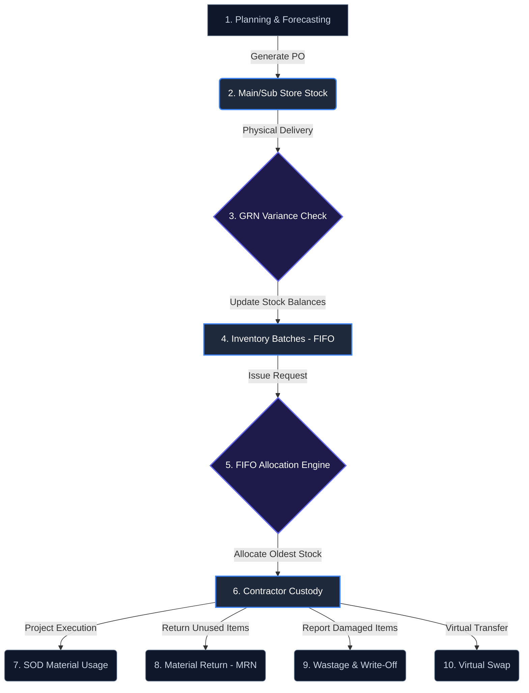

# SLTSERP - Stores & Inventory Management System
## 📦 Stores Workflow & Lifecycle Guide (ගබඩා කළමනාකරණ අත්පොත)

This guide documents the complete end-to-end material lifecycle within **SLTS OSP Nexus (SLTSERP)**. It is prepared for the **Stores Manager** to review the current system workflow, identify modifications, and suggest additions or deletions.

---

## 🗂️ Classification of Material Channels (භාණ්ඩ වර්ගීකරණය සහ ලැබීමේ ක්‍රමවේද)

In SLTSERP, inventory items are strictly categorized into 4 distinct acquisition and allocation channels:

| Channel / Category (වර්ගය) | Scope & Purpose (අරමුණ) | Examples (උදාහරණ) | Serial-Tracking? (Serial අංක පරීක්ෂාව?) |
| :--- | :--- | :--- | :--- |
| **1. SOD Materials** (සේවා ඇණවුම් අමුද්‍රව්‍ය) | Materials requested and used specifically for single customer service connections (FTTH activation). | Drop wire, ONTs, patch cords, STBs. | Yes (for active devices like ONTs, STBs). |
| **2. OSP Project Materials** (OSP ව්‍යාපෘති අමුද්‍රව්‍ය) | Large-scale materials allocated for fiber cable routing and infrastructure projects. | 24F SM Optical Fiber, Concrete/GI Poles, Joint Closures. | No (tracked by batches/drum lengths). |
| **3. General Materials** (පොදු/පරිභෝජන ද්‍රව්‍ය) | Consumables, general tools, and safety gear required for daily depot operations. | Safety jackets, helmet, PVC pipes, insulation tapes. | No (bulk quantity tracking). |
| **4. Serial-Tracked Assets** (භෞතික/කාර්යාල වත්කම්) | Corporate and field hardware allocated to specific teams or individual staff members (Asset Custody). | Laptops, Printers, Splicing Machines, OTDR meters. | **Strictly Yes** (requires unique serial ID & custody signature). |

### 📌 Special Rule: SLT-Direct Sourced Materials (ONT, STB, Phone)
* **English:** Active customer premises equipment (ONT, Set-Top Box (STB), and Telephone Instruments) are sourced directly from SLT. They do not enter the contractor's physical stores.
* **Custodian:** Received and held directly by the **Area Coordinator** (not the physical storekeeper) for distribution.
* **Tracking & Sourcing Modes:**
  * Must be strictly logged and tracked in the system to match the customer's Service Order (SOD).
  * Supported entry methods:
    1. **One-by-One (Single Serial Entry):** Manually keying in the serial code during job sheets or PAT verification.
    2. **Bulk Receipt (Excel Upload):** Uploading batch files of serials allocated to the Area Coordinator.
* **සිංහල:** පාරිභෝගික පරිශ්‍රයේ සවිකරන සක්‍රීය උපාංග (ONT, STB, සහ දුරකථන) සෘජුවම SLT වෙතින් ලබාදෙන අතර, ඒවා කොන්ත්‍රාත්කරුගේ භෞතික ගබඩාවට නොලැබේ. මේවා ලබාගන්නේ **Area Coordinator** (ප්‍රාදේශීය සම්බන්ධීකාරක) විසින් වන අතර, ඒවා පද්ධතිය හරහා තත්‍ය කාලීනව ලුහුබැඳිය (Track) යුතුය. තනි තනිව (One-by-One Serial Entry) හෝ එකවර කාණ්ඩ ලෙස (Bulk Excel Upload) පද්ධතියට ඇතුළත් කළ හැකිය.

---

## 🗺️ System Workflow Diagram (සම්පූර්ණ ක්‍රියාවලි සැකැස්ම)

---

## 📋 Task-by-Task Functional Breakdown (පියවරෙන් පියවර විග්‍රහය)

### 1. Planning & Forecasting (අවශ්‍යතා පුරෝකථනය)
* **English:** Evaluates active service orders and projects to forecast the required material counts (cables, poles, joints) before initiating procurement.
* **සිංහල:** ව්‍යාපෘති සඳහා අවශ්‍ය වන අමුද්‍රව්‍ය ප්‍රමාණයන් කල්තියා ගණනය කර අවශ්‍යතා පුරෝකථනය කිරීම.
* **System Operations:**
  * Uses `ForecastService.getMaterialForecast()` to analyze project needs.
  * Generates Draft Purchase Orders (POs) automatically.

### 2. Stock Requests & Approvals (භාණ්ඩ ඉල්ලුම් කිරීම සහ අනුමත කිරීම)
* **English:** Sub-stores or OPMCs create requisitions for materials, which must go through OSP Manager approval.
* **සිංහල:** උප ගබඩා (Sub Stores) මඟින් අවශ්‍ය භාණ්ඩ ප්‍රධාන ගබඩාවෙන් ඉල්ලුම් කිරීම සහ OSP කළමනාකරුගේ අනුමැතිය ලබාගැනීම.
* **System Operations:**
  * Stores Manager creates requests via `StockRequestService.createStockRequest()`.
  * Status is set to `PENDING`.
  * OSP Manager reviews and marks it as `APPROVED` or `REJECTED`.

### 3. Goods Receipt Note - GRN (භාණ්ඩ ලැබීම සහ සත්‍යාපනය)
* **English:** Physical deliveries are received, and quantities are verified against the approved request, logging any discrepancies.
* **සිංහල:** භෞතිකව ලැබුණු භාණ්ඩ ප්‍රමාණයන් ඉල්ලුම් කළ ප්‍රමාණයන් සමඟ සසඳා වෙනස්කම් ලියාපදිංචි කිරීම.
* **System Operations:**
  * Uses `GRNService.createGRN()` to log physical arrival using **SLT Delivery Note ID** (`sltReferenceId`).
  * The system computes variance:
    * **EXACT:** Matches the request.
    * **SHORT:** Fewer items received than approved (Negative variance).
    * **EXTRA:** Extra/unrequested items received.

### 4. FIFO Stock Allocation (FIFO ක්‍රමයට භාණ්ඩ නිකුත් කිරීම)
* **English:** To prevent stock degradation, the system auto-allocates the oldest inventory items first using FIFO rules.
* **සිංහල:** ගබඩාවේ ඇති භාණ්ඩ දිරාපත් වීම වැළැක්වීම සඳහා පැරණිතම තොගය මුලින්ම නිකුත් කිරීමේ (FIFO) නීතිය ක්‍රියාත්මක කිරීම.
* **System Operations:**
  * Uses `StockService.pickStoreBatchesFIFO()`.
  * Queries active stock batches ordered by `createdAt ASC` and decrements quantities sequentially.
  * Transfers ownership of items to **Contractor Custody**.

### 5. SOD Material Usage (ක්ෂේත්‍රයේ භාණ්ඩ භාවිතය)
* **English:** Deducts materials used during field installations from the contractor’s custody and links them to the completed service order (SOD).
* **සිංහල:** ක්ෂේත්‍රයේ වැඩ නිමකළ පසු භාවිතා කළ භාණ්ඩ ප්‍රමාණය කොන්ත්‍රාත්කරුගේ ගිණුමෙන් අඩු කර සේවා ඇණවුමට (SOD) බැර කිරීම.
* **System Operations:**
  * Triggered automatically via `SODMaterialService.recordMaterialUsage()` when an SOD is marked as `COMPLETED`.

### 6. Material Return Note - MRN (භාණ්ඩ නැවත භාරදීම)
* **English:** Any unused materials in contractor custody are physically returned to the store and added back to store inventory.
* **සිංහල:** ව්‍යාපෘතියකින් ඉතිරි වූ භාණ්ඩ නැවත ගබඩාවට භාරගෙන තොග ශේෂයන් යාවත්කාලීන කිරීම.
* **System Operations:**
  * Managed via `MRNService.createMRN()`.
  * Deducts from contractor custody and increments store stock balances.

### 7. Wastage & Damage Logging (අලාභ හානි වූ භාණ්ඩ වාර්තා කිරීම)
* **English:** Tracks damaged materials on the field, which must be approved by the OSP manager before write-off.
* **සිංහල:** ක්ෂේත්‍රයේදී හානි වූ භාණ්ඩ ලියාපදිංචි කිරීම සහ OSP කළමනාකරුගේ අනුමැතිය මත ගිණුම්වලින් කපා හැරීම.
* **System Operations:**
  * Logged via `WastageService.recordWastage()`.
  * Requires OSP manager approval (`approveWastage`/`rejectWastage`) before inventory write-off.

### 8. Virtual Swaps (තොග හුවමාරු කිරීම්)
* **English:** Allows virtual transfer of custody between two contractors directly in the field without returning materials to the physical store.
* **සිංහල:** භාණ්ඩ භෞතිකව ගබඩාවට නොගෙන ක්ෂේත්‍රයේදීම කොන්ත්‍රාත්කරුවන් දෙදෙනෙකු අතර පද්ධතිය හරහා භාණ්ඩ හුවමාරු කිරීම.
* **System Operations:**
  * Uses `VirtualSwapService.executeBulkSwap()`.

### 9. Collected CPE Recovery & Handback Tracking (පැරණි උපකරණ එකතු කිරීම සහ ආපසු භාරදීම)
* **English:** Technicians collect old Customer Premises Equipment (CPE) like routers/ONTs or STBs during new device installation. These are logged in the SOD completion flow, tracked as pending return, and handed back to Telecom monthly with a receipt/reference.
* **සිංහල:** නව උපාංග සවිකිරීමේදී පාරිභෝගිකයාගෙන් ලබාගන්නා පැරණි රවුටර (ONT) හෝ Set-Top Boxes (STB) වැනි CPE උපාංග SOD Completion එකේදී සටහන් කර, මාසය අවසානයේ ටෙලිකොම් ආයතනය වෙත භාර දී (Handback Receipt) පද්ධතිය යාවත්කාලීන කිරීම.
* **System Operations:**
  * Logged via `collectedCpes` parameter in `patchServiceOrder()`.
  * Tracked in `CollectedCPE` database table.
  * Marked as `HANDED_BACK` with a `handbackReference` code on monthly handover.

---

## 📝 Stores Manager Feedback Form (ගබඩා කළමනාකරුගේ සමාලෝචනය)

Please review and tick/write suggestions below:

| Functional Step (පියවර) | Status (තත්ත්වය) | Feedback / Modifications Required (අදහස් සහ යෝජනා) |
| :--- | :--- | :--- |
| **Material Classification** | [ ] Approved / [ ] Change | |
| **SLT-Direct Sourced Materials** | [ ] Approved / [ ] Change | Added ONT, STB, Phone tracking under Area Coordinator (One-by-One / Bulk). |
| **Forecasting & PO** | [ ] Approved / [ ] Change | |
| **Stock Request** | [ ] Approved / [ ] Change | |
| **GRN Variance** | [ ] Approved / [ ] Change | |
| **FIFO Allocation** | [ ] Approved / [ ] Change | |
| **Material Return (MRN)** | [ ] Approved / [ ] Change | |
| **Wastage Logging** | [ ] Approved / [ ] Change | |
| **Virtual Swap** | [ ] Approved / [ ] Change | |

---
**Document Status:** Draft for Review  
**ERP Version:** SLTS OSP Nexus v1.5
